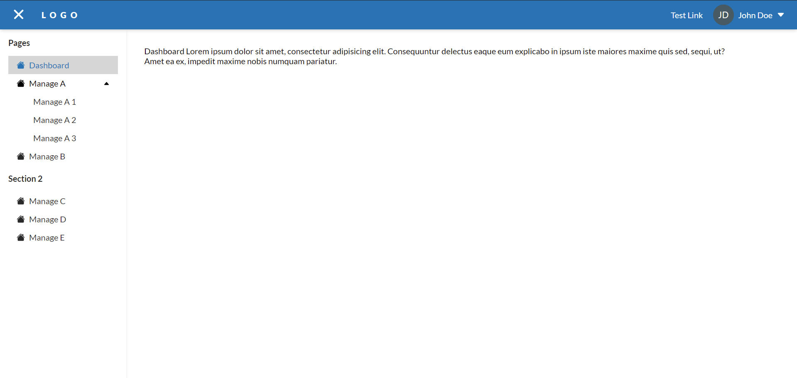
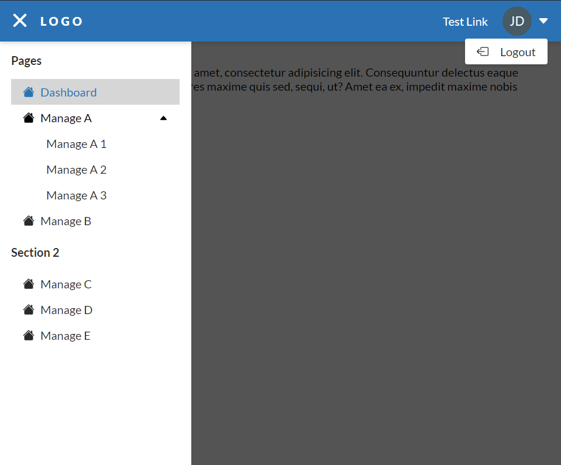
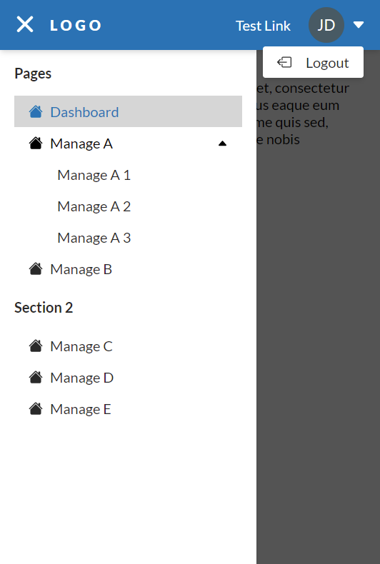

# Vue Admin Layout

This template required to use and already included in the package.json
<br/>
<a href="https://vueuse.org/" >@vueuse/core</a>

# <a href="https://zynth17.github.io/vue-admin-template/">DEMO</a>

##Desktop View



##Tablet View



##Mobile View




## Project setup
```
npm install
```

### Compiles and hot-reloads for development
```
npm run serve
```

### Compiles and minifies for production
```
npm run build
```

### Lints and fixes files
```
npm run lint
```

### Customize configuration
See [Configuration Reference](https://cli.vuejs.org/config/).
